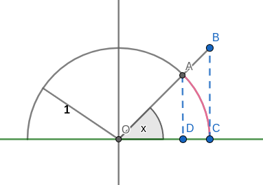

### 3.4 Derivatives of Trigonometric Functions

#### Two special Limits
>Theorem 3.11 Trigonometric Limits
$\dlim_{x \to 0}{\dfrac{\sin x}{x}} = 1$ &emsp; $\dlim_{x \to 0}{\dfrac{\cos x -1}{x}} = 0$

**Proof**  $\dlim_{x \to 0}{\dfrac{\sin x}{x}} = 1$.
$$
\begin{aligned}
\triangle OAD&< \overgroup{OAC} < \triangle OBC \\
\frac{1}{2} OD \cdot AD&< \frac{1}{2} OC^2 \cdot x < \frac{1}{2}OC \cdot BC \\
\cos x \cdot \sin x &< 1^2 \cdot x< 1 \cdot \tan x \\
\cos x &< \frac{x}{\sin x} < \frac{1}{\cos x} \\
\frac{1}{\cos x} &>  \frac{\sin x}{x} > \cos x
\end{aligned}
$$
Because $\dlim_{x \to 0}\cos x = 1 = \dlim_{x \to 0}\dfrac{1}{\cos x}$,  according to the Squeeze Theorem, $\dlim_{x \to 0}{\dfrac{\sin x}{x}} = 1$.

**Proof**  $\dlim_{x \to 0}{\dfrac{\cos x -1}{x}} = 0$.
$$
\begin{aligned}
\lim_{x \to 0}{\frac{\cos x -1}{x}} &= \lim_{x \to 0}({\frac{\cos x -1}{x}} \cdot \frac{\cos x + 1}{\cos x +1}) \\
&= \lim_{x \to 0}\frac{\cos^2 x - 1}{x(\cos x +1)} \\
&= \lim_{x \to 0}\frac{\sin^2}{x(\cos x + 1)} \\
&= \lim_{x \to 0}\frac{\sin x}{x} \cdot \lim_{x \to 0}\frac{\sin x}{\cos x + 1} \\
&= 1 \times \frac{0}{1+1} = 0
\end{aligned}
$$

>Example 1
**Calculating trigonometric limits**.
a. $\dlim_{x \to 0}{\dfrac{\sin 4x}{x}}$ &emsp; b. $\dlim_{x \to 0}{\dfrac{\sin 3x}{\sin 5x}}$

>Solution
a. To use the fact that $\dlim_{x \to 0}{\frac{\sin x}{x}} = 1$, the argument of the sine function in the numerator must bethe same as the denominator. Multiplying and dividing $\dfrac{\sin 4x}{x}$ by 4, we evaluate the limit as follows:
$$
\begin{aligned}
\lim_{x \to 0}{\frac{\sin 4x}{x}}
&= \lim_{x \to 0}{\frac{4\sin 4x}{4x}} &\text{Multiply and divide by 4.} \\
&= 4\lim_{x \to 0}{\frac{\sin 4x}{4x}} &\text{Factor out 4.} \\
&= 4\lim_{t \to 0}{\frac{\sin t}{t}} &\text{Let t=4x; t->0 as x->0.} \\
&= 4(1) = 4 &\text{Theorem 3.11}
\end{aligned}
$$
b. The first step is to divide the numerator and denominator of $\dfrac{\sin 3x}{\sin 5x}$ by $x$:
$$
\frac{\sin 3x}{\sin 5x} = \frac{(\sin 3x)/x}{(\sin 5x)/x}
$$
As in part (a), we now divide and multiply $\frac{\sin 3x}{x}$ by $3$, and divide and multiply $\frac{\sin 3x}{x}$ by $5$. in the numerator, we let $t=3x$ and in the denominator, we let $u=5x$. In each case, $t \to 0$ and $u \to 0$ as $x \to 0$. Therefore,
$$
\begin{aligned}
\lim_{x \to 0}{\frac{\sin 3x}{\sin 5x}}
&= \lim_{x \to 0}{\frac{\frac{3\sin 3x}{3x}}{\frac{5\sin 5x}{5x}}} \\
&= \frac{3}{5} \cdot {\frac{\dlim_{t \to 0}{\frac{\sin t}{t}}}{\dlim_{u \to 0}{{\frac{\sin u}{u}}}}} &\text{t=3x in numerator and u=5x in denominator.} \\
& = \frac{3}{5}\cdot\frac{1}{1} =\frac{3}{5}
\end{aligned}
$$

#### Derivatives of Sine and Cosine Functions
>Theorem 3.12 Derivatives of Sine and Cosine
$\dfrac{d}{dx}(\sin x) = \cos x$ &emsp; $\dfrac{d}{dx}(\cos x) = -\sin x$

**Proof**
We start with the definition of the derivative.
$$
\begin{aligned}
f'(x) &= \lim_{h \to 0}{\frac{\sin(x+h) - \sin x}{h}} &\text{Definition of the derivative.}\\
&= \lim_{h \to 0}{\frac{\sin x\cos h + \cos x\sin h - \sin x}{h}} &\text{Sine addition identity.} \\
&= \lim_{h \to 0}{\frac{\sin x(\cos h - 1) + \cos x\sin h}{h}} \\
&= \lim_{h \to 0}{\frac{\sin x(\cos h - 1)}{h}} + \lim_{h \to 0}{\frac{\cos x\sin h}{h}} &\text{Theorm 2.3.}\\
&= \sin x \lb\bf{\lim_{h \to 0}{\frac{\cos h - 1}{h}}}\rb + \cos x\lb\bf{\lim_{h \to 0}{\frac{\sin h}{h}}}\rb &\text{Both sinx and cosx are independent of h.}\\
&= (\sin x)(0) + (\cos x)(1) &\text{Theorm 3.11.}\\
&= \cos x
\end{aligned}
$$
We have proved the import result that $\dfrac{d}{dx}(\sin x) = \cos x$.
The fact that $\dfrac{d}{dx}(\cos x) = -\sin x$ is proved in a similar way using a cosine addition identity.

>Example 2
**Derivatives involving trigonometric functions**
a. $y=e^{2x}\cos x$ &emsp; b. $y=\sin x - x\cos x$ &emsp; c. $y = \dfrac{1 + \sin x}{1 - \sin x}$

>Solution
a. $y' = e^{2x}(2\cos x - \sin x)$
b. $y' = x\sin x$
c. $y' = \dfrac{2\cos x}{(1-\sin x)^2}$

#### Derivatives of Other Trigonometric Functions

>Example 3
**Derivatives of the tangent function.** Calculate $\dfrac{d}{dx}(\tan x)$.

>Solution
$$
\begin{aligned}
\frac{d}{dx}(\tan x) &= \frac{d}{dx}(\frac{\sin x}{\ cos x}) \\
&= \frac{\cos x\cos x - \sin x(-\sin x)}{{\cos^2}x} \\
&= \frac{{\cos^2}x + {\sin^2}x}{{\cos^2}x} \\
&= \frac{1}{{\cos^2}x} \\
&= {\sec^2}x
\end{aligned}
$$

>Theorem 3.13 Derivatives of the Trigonometric Functions
$$
\begin{aligned}
\frac{d}{dx}(\sin x)&= \cos x \qquad
&\frac{d}{dx}(\cos x)&= -\sin x \\
\frac{d}{dx}(\tan x)&= \sec^2 x \qquad
&\frac{d}{dx}(\cot x)&= -\csc^2 x \\
\frac{d}{dx}(\sec x)&= \sec x\tan x \qquad
&\frac{d}{dx}(\csc x)&= -\csc x\cot x
\end{aligned}
$$

>Example 4
**Derivatives involving $\sec x$ and $\csc x$.** Find the derivative of $y = \sec x\csc x$.

>Solution
$$
\begin{aligned}
\frac{dy}{dx} &= \frac{d}{dx}(\sec x\csc x) \\
&= \frac{d}{dx}(\sec x)\cdot\csc x + \sec x\frac{d}{dx}(\csc x) &\text{Product Rule} \\
&= \sec x\tan x\csc x + \sec x(-\csc x\cot x) \\
&= \frac{1\cdot\sin x\cdot 1}{\cos x\cdot\cos x\cdot\sin x} - \frac{1\cdot\cos x\cdot 1}{\cos x\cdot\sin x\cdot\sin x} &\text{Write functions in terms of sinx and cosx}\\
&= \frac{1}{{\cos^2} x} - \frac{1}{{\sin^2} x} \\
&= {\sec^2} x - {\csc^2} x
\end{aligned}
$$

#### Higher-Order Trigonometric Functions

A few higher-order derivatives of $y=\sin x$ reveal a pattern.
$$
\begin{aligned}
\frac{dy}{dx}&= \cos x \qquad
&\frac{{d^2}y}{dx^2}&= -\sin x \\
\frac{{d^3}y}{dx^3}&= -\cos x \qquad
&\frac{{d^4}y}{dx^4}&= \sin x
\end{aligned}
$$

>Example 5
**Second order derivative.** Find the derivative of $y = \csc x$.

>Solution
$$
\begin{aligned}
\frac{{d^2}y}{dx^2} &= \frac{d}{dx}(\frac{dy}{dx}) \\
&= \frac{d}{dx}(-\csc x\cot x) \\
&= (\frac{d}{dx}(-\csc x))\cot x - \csc x(\frac{d}{dx}(\cot x)) \\
&= (\csc x\cot x)\cot x - \csc x(-{\csc^2} x)) \\
&= \csc x({\cot^2}x + {\csc^2}x) \\
\end{aligned}
$$
